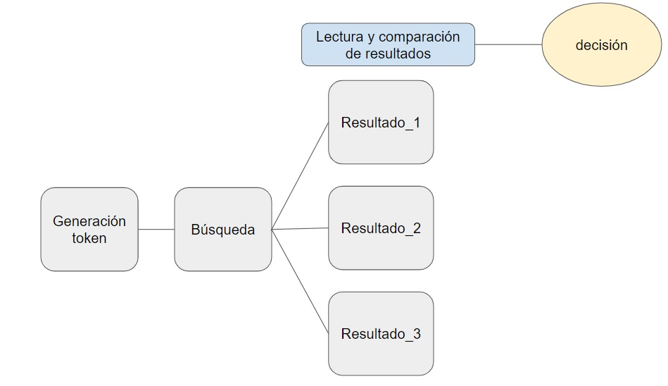

 

>   
    Fecha                     | 12/05/2024
    Challenge realizado por   | Francisco Guzmán

# **Parte Analytics**

## **Objetivos:**

### Cree un panel utilizando una herramienta de visualización de datos, en uno de los siguientes reproductores: MS Power BI, Tableau o Looker. Como alcance se debe analizar la evolución, crecimiento de internet, usuarios, suscriptores, etc. en Argentina y sus causas. 

## **Respuesta:**
En la notebook [00_challenge_ Analytics](https://github.com/fguzman282/challenge_meli/blob/master/00_challenge_%20Analytics.ipynb) procesa la información necesaria para alcanzar las conclusiones deseadas, para ello se tomo información de las bases de datos del **banco mundial**, y se procesaron utilizando python y la librería pandas.

Por otro lado, se tomó información del **informe de conectividad del INDEC** correspondiente al 4q del año 2023. Este documento se encontraba en **pdf**, para lo cual utilizaron técnicas de extracción de textos utilizando python y la librería **PyPDF2**.

- [Tablero con análisis visuales](https://lookerstudio.google.com/reporting/2462ebfc-3bed-460b-b128-ac2779f1bdd1/page/ryozD)

# **Parte SQL**

## **Objetivos:**

### A partir de la siguiente necesidad, se requiere diseñar un DER que responda al modelo del negocio. Luego, se debe responder mediante SQL diferentes preguntas.  

**Descripción de la necesidad**

Teniendo en cuenta el modelo de ecommerce que manejamos, tenemos algunas entidades básicas que queremos representar: Customer, Order, Item y Category. 

- **Customer:** Es la entidad donde se encuentran todos nuestros usuarios, ya sean Buyers o Sellers del Site. Los principales atributos son email, nombre, apellido, sexo, dirección, fecha de nacimiento, teléfono, entre otros. 
- **Item:** Es la entidad donde se encuentran los productos publicados en nuestro marketplace. El volumen es muy grande debido a que se encuentran todos los productos que en algún momento fueron publicados. Mediante el estado del ítem o fecha de baja se puede detectar los ítems activos del marketplace.  
- **Category**: Es la entidad donde se encuentra la descripción de cada categoría con su respectivo path. Cada ítem tiene asociado una categoría. 
- **Order:** La order es la entidad que refleja las transacciones generadas dentro del site (cada compra es una order). En este caso no vamos a contar con un flujo de carrito de compras por lo tanto cada ítem que se venda será reflejado en una order independientemente de la cantidad que se haya comprado.

**Flujo de Compras**
- Un usuario ingresa al sitio de Mercado Libre para comprar dos dispositivos móviles iguales. 
- Realiza la búsqueda navegando por la categorías Tecnología > Celulares y Teléfonos > Celulares y Smartphones, y finalmente encuentra el producto que necesita comprar. 
- Procede con la compra del mismo seleccionado **dos unidades**, el cual genera una orden de compra.

  **A resolver**

- Listar los usuarios que cumplan años el día de hoy cuya cantidad de ventas realizadas en enero 2020 sea superior a 1500. 
- Por cada mes del 2020, se solicita el top 5 de usuarios que más vendieron($) en la categoría Celulares. Se requiere el mes y año de análisis, nombre y apellido del vendedor, cantidad de ventas realizadas, cantidad de productos vendidos y el monto total transaccionado. 

## **Respuesta:**

En la notebook [02_respuestas_negocio_sql](https://github.com/fguzman282/challenge_meli/blob/master/02_respuestas_negocio_sql.ipynb) procesa la información necesaria para dar respuesta a las preguntas del negocio mediante **SQL**. 

Adicional a ello, en la notebook [01_genera_bases_ejercicio_sql](https://github.com/fguzman282/challenge_meli/blob/master/01_genera_bases_ejercicio_sql.ipynb) se genera el universo para dar respuestas a las preguntas de negocio. **Es un valor agregado de mi parte** consiste en un programa que genera datos ficticios cada vez que corra genera clientes ficticios aleatorio.

# **Parte SQL**

## **Objetivos:**

### Realizar un análisis sobre la oferta/vidriera de las opciones de productos que responden a distintas búsquedas en el sitio Mercadolibre.com.ar  utilizando el lenguaje Python y las bibliotecas que considere necesarias.

 **A resolver**

-  Barrer una lista de más de 150 ítems ids en el servicio público
-  Por cada resultado, realizar el correspondiente GET por Item_Id al recurso público
-  Escribir los resultados
-  Elaborar el diseño y la documentación de la solución
-  Análisis exploratorio
      

## **Respuesta:**

En la notebook [03_Python_y_APIs](https://github.com/fguzman282/challenge_meli/blob/master/03_Python_y_APIs.ipynb) se documenta un programa que consume datos de el site https://www.mercadolibre.com.ar/ haciendo uso de la api, para ello el usuario debe ejecutar paso a paso la notebook.

- El primer paso consiste en generar el token. Una vez generado y utilizado el token, usuario tendrá acceso a explotar la información.
- Como segundo paso, el usuario debe escribir por consola el artículo buscado, el programa generará un csv normalizado y lo guardará en una ruta del proyecto para luego ser analizado.
- Una vez obtenidos los resultados de las búsquedas, se cargan los csv de los resultados a comparar y el programa entrega análisis descriptivo de los universos y compara en plot los universos, en donde se puede tener un conocimiento amplio de los productos buscados. Para más detalle te invito a explorar este mágico universo.

**Diagrama general del programa**
 

La información obtenida nos ayuda en la evaluación del Precio y el Modo de Compra antes de tomar cualquier decisión, tambien nos ayuda a verificar el modo de compra. Por ejemplo, el producto puede estar disponible para comprar en "compra inmediata".

**MercadoPago**
Otro aspecto crucial es si el vendedor acepta MercadoPago lo que me da la confianza de que mi transacción será segura y rápida.

**Garantía y Envío**
Reviso si el producto tiene garantía, lo que me da tranquilidad en caso de que surja algún problema.

Además, me fijo en la indicación de envío gratuito. Veo que el producto incluye envío gratuito, lo cual es un gran incentivo, ya que me ahorra costos adicionales.

**Conclusión**
Después de revisar todas estas variables, decido proceder con la compra. Hago clic en "Comprar ahora", elijo MercadoPago como mi método de pago, y aprovecho el envío gratuito. Me siento seguro sabiendo que tengo una garantía de 1 año para estos aproductos.

## **Nota** 
Es posible que en el GIT no se aprecien algunos detalles como por ejemplo el **plot** del modelo comparador por producto, pero estoy seguro que cuando subas el proyecto a tu **drive** podrás ver la magia detrás del código

**Muchas gracias por el challenge**, me sirvió para darme cuenta de las cosas que soy capaz de crear.

**Espero que lo disfrutes así como yo cuando lo desarrolle.**

**Saludos Fran.**
